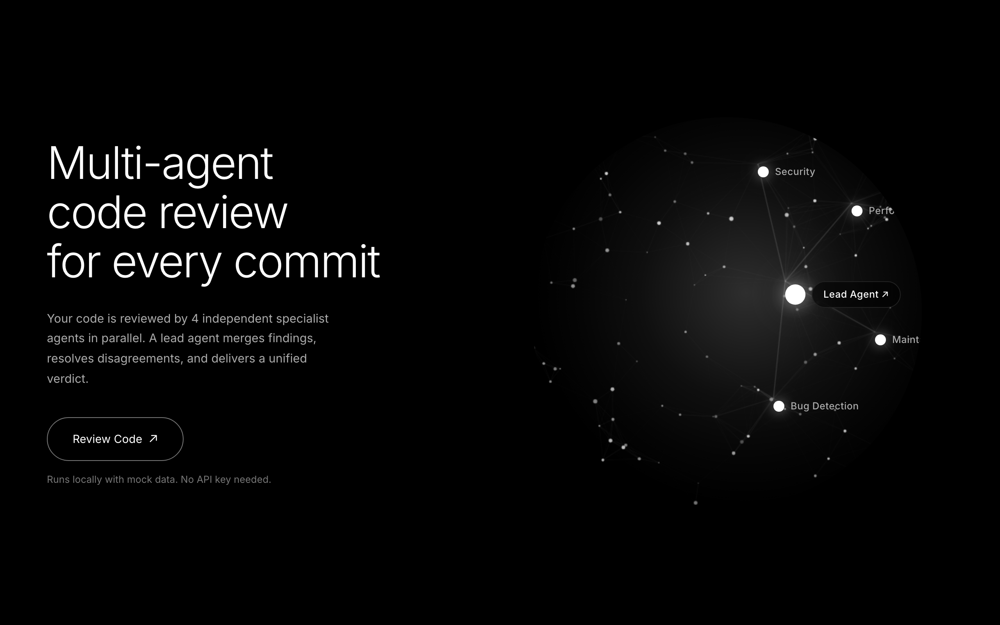
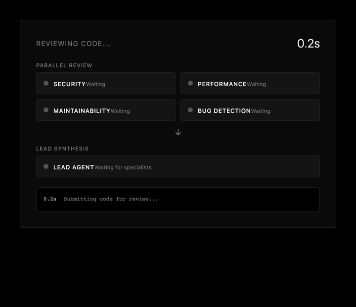
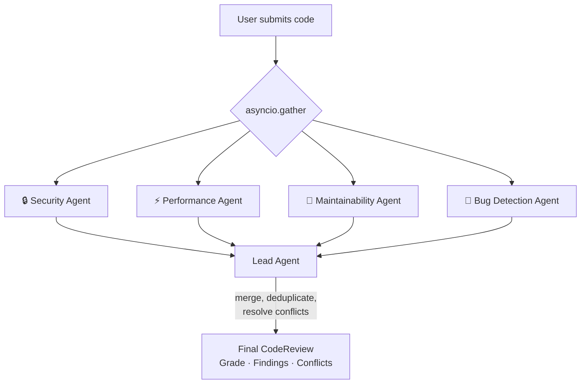
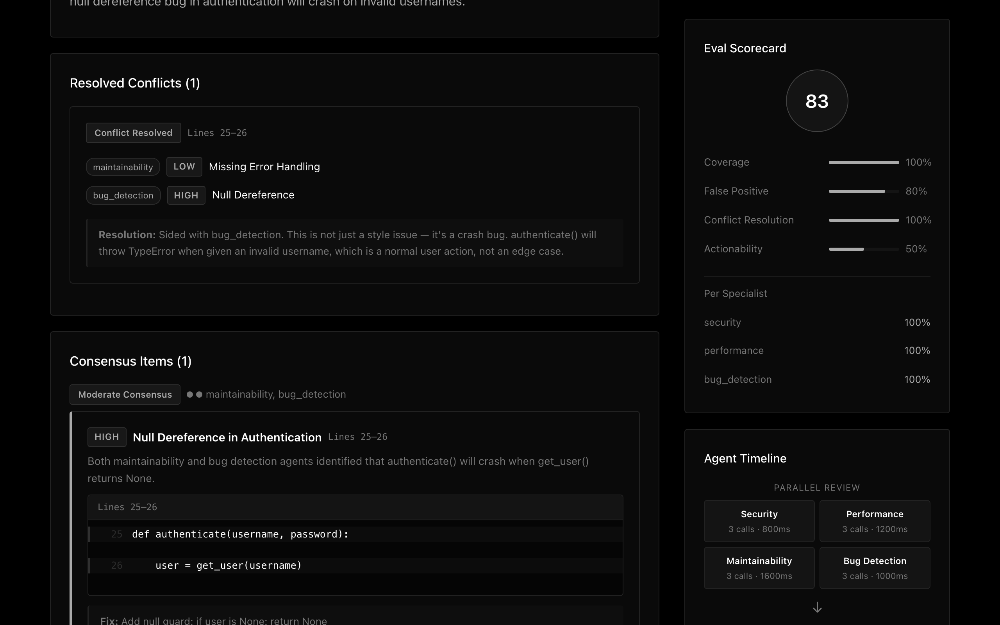

# Multi-Agent Code Reviewer

4 specialist AI agents review your code in parallel, then a lead agent synthesizes findings and resolves disagreements.

<p>
  
  
</p>

## Architecture



Each specialist has isolated context — they can't see each other's work. The lead agent receives all reports and:
- Groups findings by code location
- Identifies where specialists agree (consensus items)
- Resolves conflicts when specialists disagree on severity
- Assigns a final grade (A-F)

## Key Features

- **Parallel multi-agent orchestration** — fan-out/fan-in with `asyncio.gather`
- **Structured disagreement resolution** — when specialists rate the same code differently, the lead explains which it sides with and why
- **Per-specialist tool use** — each agent has 3 domain-specific tools (14 total)
- **Real-time progress streaming** — SSE-powered live view of each agent's tool calls and reasoning as they work
- **Eval framework** — ground-truth scoring across 4 dimensions: coverage, false positive rate, conflict resolution quality, actionability
- **Compare mode** — same code reviewed by different team compositions to see what gets missed
- **LM Studio compatible** — works with any OpenAI-compatible local model

## Review Output



Conflict resolution, consensus items, eval scorecard, and agent timeline.

## Tech Stack

Python, FastAPI, Jinja2, Pydantic v2, Anthropic tool_use API

## Quick Start

```bash
pip install -r requirements.txt
python3 -m uvicorn app:app --port 8001
# open http://localhost:8001
```

With a local LLM (LM Studio, Ollama, etc.):

```bash
LLM_PROVIDER=openai \
OPENAI_BASE_URL=http://localhost:1234/v1 \
OPENAI_API_KEY=lm-studio \
OPENAI_MODEL=google/gemma-4-12b-qat \
python3 -m uvicorn app:app --port 8001
```

Or with Docker:

```bash
docker compose up --build
```

Works out of the box with mock data — no API keys needed. Click "User Service", "Data Processor", or "Clean API" to try the demo samples.

## Mock Samples

| Sample | Grade | Issues | Conflicts | Key Findings |
|--------|-------|--------|-----------|--------------|
| User Service | F | 9 | 1 | SQL injection (CRITICAL), plaintext passwords, null deref |
| Data Processor | D | 8 | 1 | O(n^2) loop, wrong median, division by zero |
| Clean API | A | 1 | 0 | Well-written code, one INFO-level note |

## Tests

```bash
python3 -m pytest tests/ -v
# 84 tests across 7 modules
```

## Project Structure

```
app.py                  FastAPI server + SSE streaming
agent/
  schemas.py            Pydantic models (ReviewComment, CodeReview, ConflictItem, etc.)
  tools.py              Per-specialist tool definitions (Anthropic format)
  specialists.py        Specialist configs (prompts, tools)
  orchestrator.py       Fan-out/fan-in orchestration with progress callbacks
  mock.py               3 code samples + mock clients
  clients.py            Client factory (mock, Anthropic, or OpenAI-compatible)
  eval.py               Ground-truth evaluation
  guardrails.py         Input validation + injection detection
  store.py              In-memory cache with TTL
  compare.py            Team composition comparison
templates/              Jinja2 HTML (index, review, compare)
static/style.css        Monochrome dark theme
tests/                  84 tests across 7 modules
```
